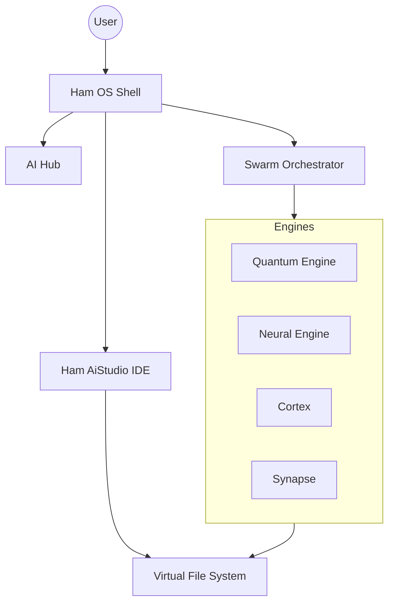

# Ham AiStudio Architecture

## Engine Overview
The system consists of 23 specialized engines working in a swarm configuration.

## Data Flow
State is persisted via a Centralized State Bridge with local-first sync and cloud replication.
